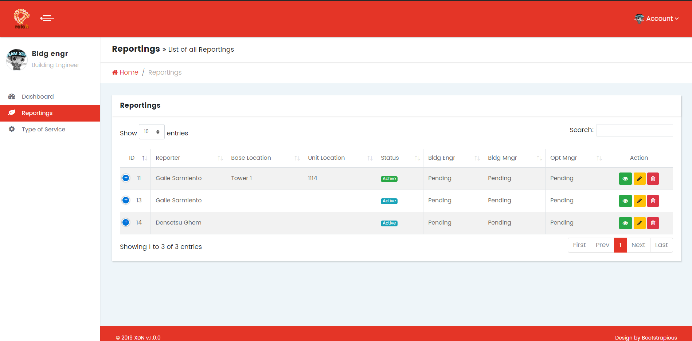
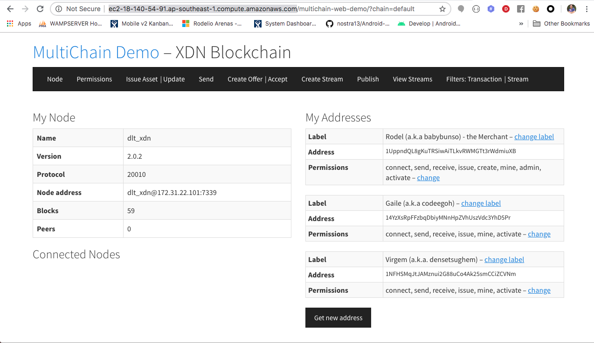
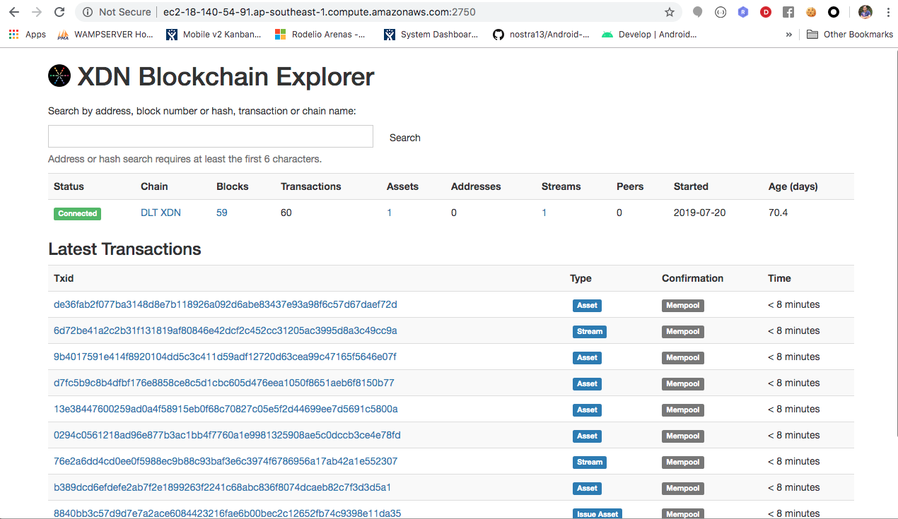
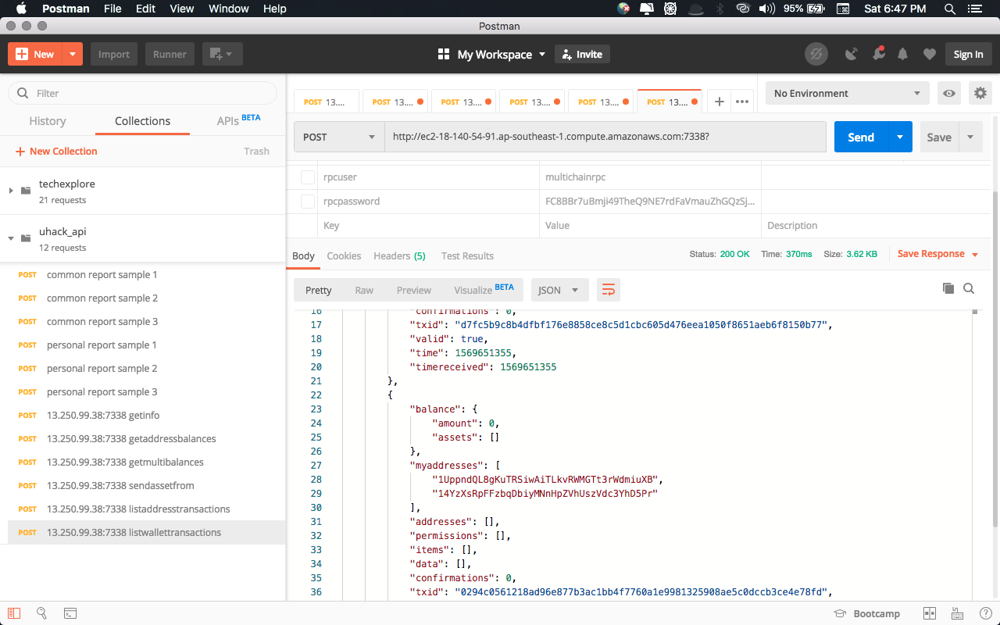

# U-Hack 2019

###### Team Name:  
**Team XDN**

###### Challenges:
**HOW MIGHT WE**(5) use new technologies to **_AUTOMATE_** service, repairs, and construction requests?

###### Solution (MVP):
**XDN-DLT:** A Permissioned Blockchain-based Platform for Automated Reporting and Requisition of Services.

  
###### XDN-Network Web Links and Demos:
- **CMS / Dashboard:** <a href="https://9e451344.ngrok.io/uhack2019/xdn-cms/">https://9e451344.ngrok.io/uhack2019/xdn-cms/</a>
- **Blockchain Explorer:** <a href="http://ec2-18-140-54-91.ap-southeast-1.compute.amazonaws.com:2750">http://ec2-18-140-54-91.ap-southeast-1.compute.amazonaws.com:2750</a>
- **Web Demo:** <a href="http://ec2-18-140-54-91.ap-southeast-1.compute.amazonaws.com/multichain-web-demo/?chain=default">http://ec2-18-140-54-91.ap-southeast-1.compute.amazonaws.com/multichain-web-demo/</a>
- **Github Repo:** <a href="https://github.com/babybunso/xdn_techxplore">https://github.com/babybunso/xdn_techxplore</a>

  
###### XDN-SPV Wallet Addresses:
- Rodel _(a.k.a. babybunso):_ **1UppndQL8gKuTRSiwAiTLkvRWMGTt3rWdmiuXB  _(Merchant Wallet)_**
- Gaile _(a.k.a. codeegoh):_ **14YzXsRpFFzbqDbiyMNnHpZVhUszVdc3YhD5Pr**
- Virgem _(a.k.a. densetsughem):_ **1NFHSMqJtJAMznui2G88uCo4Ak25smCCiZCVNm**

  Credits to **Multichain** for the **_Permissioned_ Distributed Ledger Technology (DLT)**:
- <a href="https://www.multichain.com">Multichain</a> 
- <a href="https://github.com/MultiChain/multichain-web-demo">Multichain Web Demo</a> 
- <a href="https://github.com/MultiChain/multichain-explorer">Multichain Explorer</a> 

  
###### Demo Screens:

